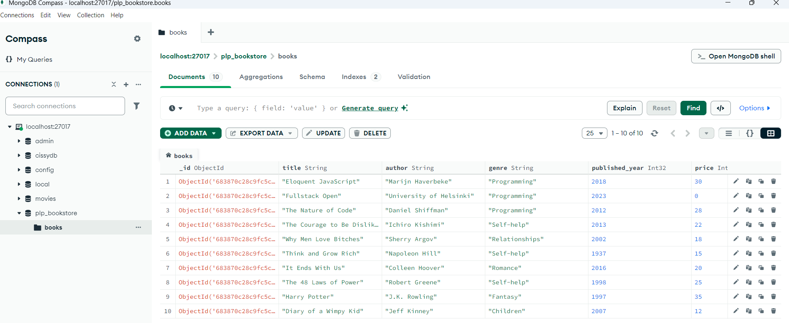
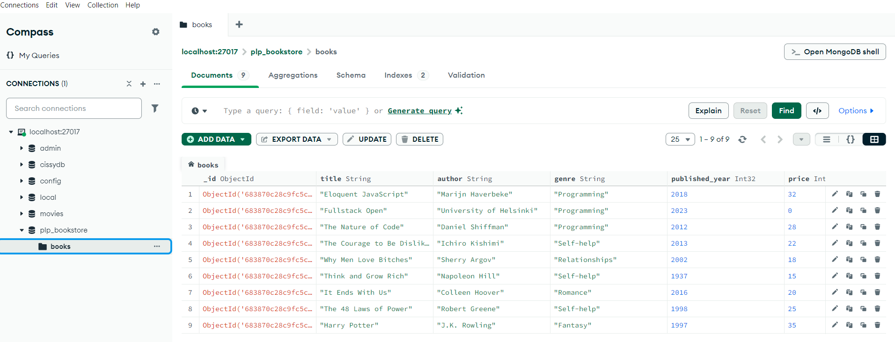

# 📚 PLP Bookstore - MongoDB Fundamentals Assignment

This project demonstrates the use of MongoDB and Mongoose to model, insert, query, and analyze a dataset of books. Built using Node.js and run in VS Code, this assignment showcases CRUD operations, aggregation pipelines, indexing, and performance optimization.

---

## 🛠️ Tech Stack
- Node.js
- MongoDB (local or Atlas)
- Mongoose
- Dotenv
- Nodemon

---

## 📁 Project Structure
plp_bookstore/
├── models/
│ └── Book.js # Schema and model definition
├── insert_books.js # Script to insert books into DB
├── queries.js # CRUD + advanced queries
├── aggregation.js # Aggregation pipeline examples
├── index.js # Main file to connect to MongoDB
├── .env # Environment variables (MONGO_URI)
├── .gitignore # Ignore .env and node_modules
├── README.md

---

## ⚙️ Setup Instructions

1. **Clone the repo**:
   ```bash
   git clone <your-repo-url>
   cd plp_bookstore
npm install
npm run dev
node queries.js
node aggregations.js


##   📸 Sample Screenshot




## ✅ Features
Inserted 10 sample books

Queried by genre, year, and updated/deleted records

Aggregated data by price, author, and decade

Indexed queries to improve performance

## 📬 Author
Silvya Bosibori
MongoDB Fundamentals Assignment | PLP 2025